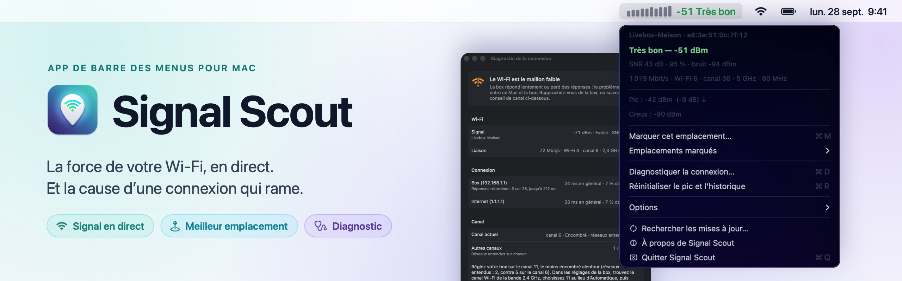
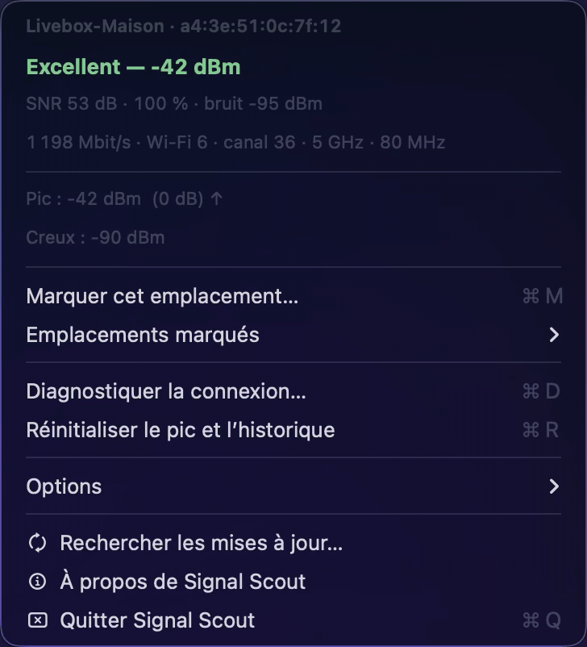
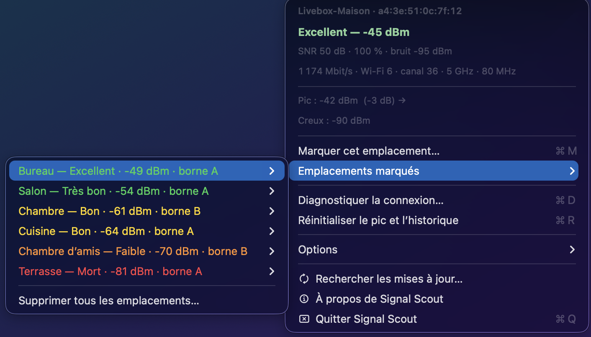
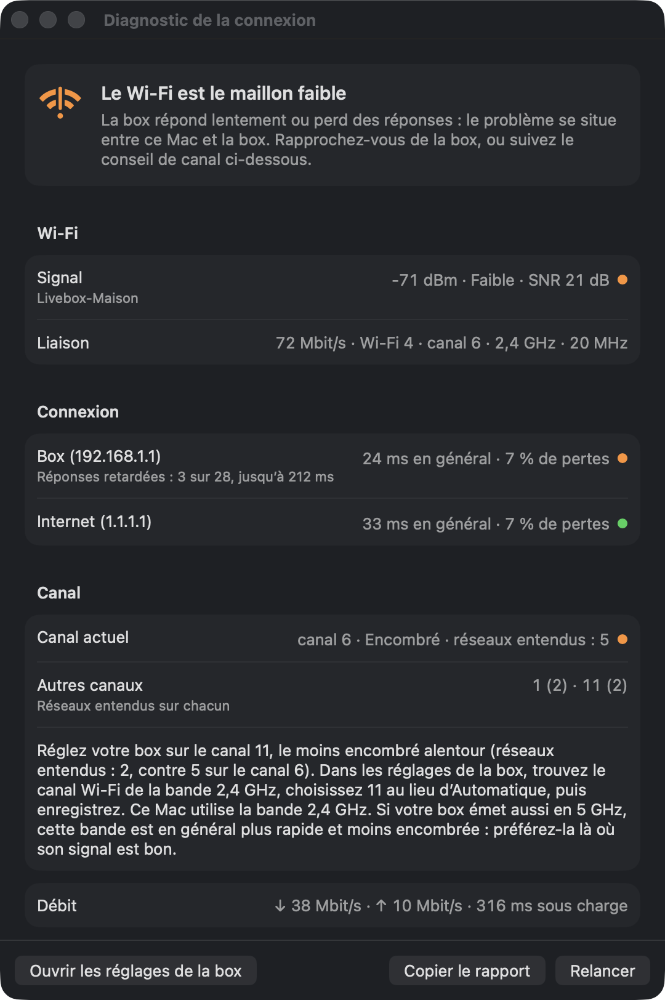
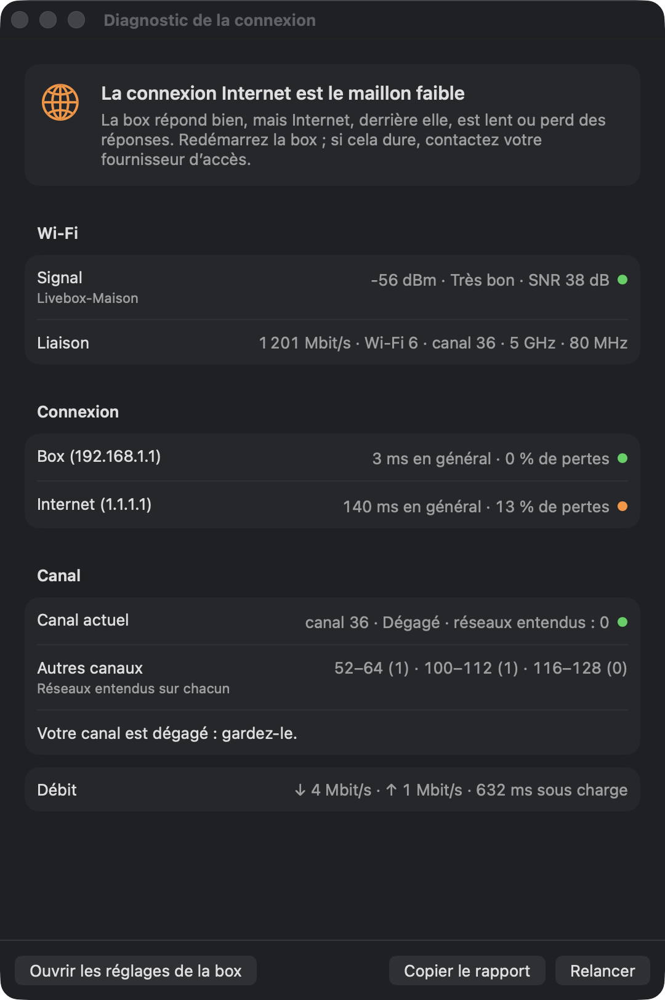
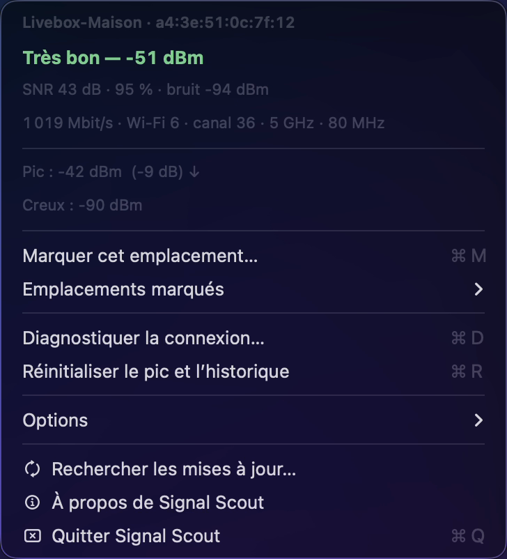

<div align="center">

<picture>
  <source media="(prefers-color-scheme: dark)" srcset="docs/images/banner-dark.png">
  <source media="(prefers-color-scheme: light)" srcset="docs/images/banner-light.png">
  
</picture>

<br>
<br>

[![Dernière version][badge-version]][releases]
[![Téléchargements][badge-downloads]][releases]
[![macOS 14 ou plus récent][badge-macos]](#installation)
[![Apple silicon et Intel][badge-universal]](#installation)
[![Français et anglais][badge-languages]](#premiers-pas)

[badge-version]: https://img.shields.io/github/v/release/Asteerix/signal-scout-releases?style=flat&label=version&color=0969da
[badge-downloads]: https://img.shields.io/github/downloads/Asteerix/signal-scout-releases/total?style=flat&label=t%C3%A9l%C3%A9chargements&color=0969da
[badge-macos]: https://img.shields.io/badge/macOS-14%2B-57606a?style=flat&logo=apple&logoColor=white
[badge-universal]: https://img.shields.io/badge/Apple%20silicon%20%2B%20Intel-universel-57606a?style=flat
[badge-languages]: https://img.shields.io/badge/langues-fran%C3%A7ais%20%C2%B7%20anglais-57606a?style=flat
[releases]: https://github.com/Asteerix/signal-scout-releases/releases/latest
[download]: https://github.com/Asteerix/signal-scout-releases/releases/latest/download/Signal-Scout.dmg

<a href="https://github.com/Asteerix/signal-scout-releases/releases/latest/download/Signal-Scout.dmg"></a>

<sub>Gratuit · macOS 14 Sonoma ou plus récent · Apple silicon et Intel · <a href="#installation">aide à l'installation</a></sub>

<br>

**[Installation](#installation)** · **[Emplacements](#trouver-le-meilleur-emplacement)** · **[Diagnostic](#diagnostiquer-la-connexion)** · **[Questions](#questions-fréquentes)** · **[Nouveautés](CHANGELOG.md)**

</div>

## Présentation

Signal Scout affiche la force de votre Wi-Fi en permanence dans la barre des menus du Mac : une
mini-courbe, la mesure et un verdict coloré, de *Excellent* à *Mort*. Un clic ouvre le détail,
qui continue de bouger pendant que vous vous déplacez : promenez-vous menu ouvert et trouvez le
meilleur endroit pour travailler, ou pour placer votre box, un répéteur ou un point d'accès. Et
quand la connexion rame, un diagnostic dit en quelques secondes si c'est le Wi-Fi, la box ou
Internet.

<p align="center">
  
</p>

<table>
<tr>
<td width="33%" valign="top">

<p><b>Le signal en direct</b><br>
Courbe, mesure et verdict en couleur dans la barre des menus, rafraîchis chaque seconde, même menu ouvert.</p>
</td>
<td width="33%" valign="top">

<p><b>Le meilleur emplacement</b><br>
Marquez le bureau, le salon, la terrasse : Signal Scout les classe, et distingue la box d'un répéteur.</p>
</td>
<td width="33%" valign="top">

<p><b>Le coupable en un clic</b><br>
Délai et pertes vers la box, puis vers Internet : le verdict dit ce qui cloche, et quoi faire.</p>
</td>
</tr>
<tr>
<td width="33%" valign="top">

<p><b>Le canal le plus calme</b><br>
Les réseaux voisins sont écoutés, et Signal Scout indique le canal à choisir dans les réglages de la box.</p>
</td>
<td width="33%" valign="top">

<p><b>Débit et rapport</b><br>
Un test de débit avec les serveurs d'Apple, et tout le diagnostic en texte, à copier pour qui vous aide.</p>
</td>
<td width="33%" valign="top">

<p><b>Discrète</b><br>
Ni compte, ni publicité, ni statistiques. Internet n'est contacté qu'à votre initiative.</p>
</td>
</tr>
</table>

## Installation

Il faut un Mac sous **macOS 14 Sonoma ou plus récent**, Apple silicon ou Intel. Aucun autre
logiciel n'est nécessaire.

1. **Téléchargez** [`Signal-Scout.dmg`][download]. Il se trouve aussi en bas de la
   [page de la dernière version][releases], dans la partie **Assets**. Aucun compte GitHub n'est
   nécessaire.
2. **Ouvrez** le fichier téléchargé. Une fenêtre montre l'app et un raccourci vers le dossier
   Applications.
3. **Glissez** l'icône **Signal Scout** sur **Applications**.
4. **Ouvrez** le dossier Applications, puis double-cliquez sur **Signal Scout**.

> [!IMPORTANT]
> Signal Scout n'est pas distribuée par l'App Store ni notarisée par Apple. La première fois,
> macOS refuse donc de l'ouvrir, avec un message du type « Signal Scout n'a pas été ouvert » ou
> « Apple n'a pas pu confirmer que Signal Scout ne contient pas de logiciel malveillant ». C'est
> normal, et cela ne se produit qu'une fois : suivez les étapes ci-dessous.

### La première ouverture : autoriser l'app

1. Dans ce message, cliquez sur **Terminé** (ou **OK**). Surtout pas sur *Placer dans la
   corbeille*.
2. Ouvrez le menu **Pomme** () › **Réglages Système** › **Confidentialité et sécurité**.
3. Faites défiler jusqu'à la section **Sécurité**. En face du message sur Signal Scout, cliquez sur
   **Ouvrir quand même**.
4. Confirmez dans la fenêtre qui s'affiche (**Ouvrir quand même** ou **Ouvrir**), puis avec votre
   mot de passe ou Touch ID.

Le bouton **Ouvrir quand même** reste disponible environ une heure après la tentative
d'ouverture ; passé ce délai, double-cliquez de nouveau sur l'app pour le faire réapparaître.
Ensuite, Signal Scout s'ouvre normalement, comme n'importe quelle app. Apple décrit la procédure
dans [Ouvrir une app Mac d'un développeur non identifié](https://support.apple.com/fr-fr/guide/mac-help/mh40616/mac).

<details>
<summary>Variante pour les habitués du Terminal</summary>

Après avoir copié l'app dans Applications, cette commande retire la quarantaine posée par le
téléchargement, et l'app s'ouvre directement :

```sh
xattr -dr com.apple.quarantine "/Applications/Signal Scout.app"
```

</details>

<details>
<summary>Vérifier le fichier téléchargé</summary>

Chaque version publie la somme SHA-256 de son image disque, `Signal-Scout.dmg.sha256`, en bas de
la [page de la version][releases]. Téléchargez-la à côté du `.dmg`, puis, dans le Terminal :

```sh
cd ~/Downloads && shasum -a 256 -c Signal-Scout.dmg.sha256
```

La commande répond `Signal-Scout.dmg: OK` si le fichier est intact.

</details>

## Premiers pas

Signal Scout n'a **ni fenêtre ni icône dans le Dock** : elle vit dans la **barre des menus**, en
haut à droite de l'écran, à côté de l'horloge et des icônes Wi-Fi et batterie. Elle suit la langue
du Mac, en français ou en anglais.

Au premier lancement, une fenêtre de bienvenue indique où la trouver et propose trois réglages,
cochés par défaut :

| Réglage | Pourquoi |
| --- | --- |
| **Lancer Signal Scout à l'ouverture de session** | L'app démarre avec le Mac. Si macOS demande une confirmation, Réglages Système s'ouvre au bon endroit : autorisez Signal Scout. |
| **Afficher le nom du réseau** | macOS ne communique le nom des réseaux Wi-Fi qu'aux apps autorisées à utiliser la localisation. Acceptez la demande qui suit. Signal Scout ne lit jamais la position du Mac. |
| **Rechercher les mises à jour une fois par jour** | L'app demande à GitHub le numéro de la dernière version, et l'annonce dans son menu. Rien d'autre n'est envoyé. |

Refuser l'un ou l'autre ne gêne pas la mesure. Tous se changent à tout moment dans le menu
**Options**.

> [!TIP]
> Vous ne trouvez plus l'app ? Rouvrez **Signal Scout** depuis le dossier Applications, Launchpad
> ou Spotlight : son menu se déroule tout seul sous sa mesure.

## Trouver le meilleur emplacement

1. **Ouvrez le menu** en cliquant sur la mesure, et laissez-le ouvert : les chiffres continuent de
   bouger.
2. **Repartez de zéro** avec **Réinitialiser le pic et l'historique** (⌘R).
3. **Déplacez-vous lentement.** La ligne **Pic** indique le meilleur signal mesuré et l'écart avec
   la mesure actuelle. Un écart proche de `0 dB` et une flèche `↑` signifient que vous vous
   rapprochez de la meilleure zone.
4. **À chaque endroit candidat, restez immobile une dizaine de secondes**, puis choisissez
   **Marquer cet emplacement…** (⌘M) et donnez-lui un nom, par exemple « Bureau » ou « Canapé ».
   La valeur retenue est la moyenne des 10 dernières secondes : une baisse passagère ne fausse pas
   le résultat.
5. **Comparez** dans **Emplacements marqués** : ils sont classés du meilleur au pire, dans la
   couleur de leur verdict. Chacun ouvre un sous-menu avec son détail, **Renommer…** et
   **Supprimer**.

<p align="center">
  
</p>

Chaque emplacement retient aussi le réseau et la **borne** captés. Avec un répéteur ou un système
Wi-Fi maillé, le Mac passe d'une borne à l'autre en se déplaçant : dès que vos emplacements en
utilisent plusieurs, leur titre l'indique (« borne A », « borne B »), ce qui montre la zone
couverte par chacune. Ci-dessus, la borne B, un répéteur, dessert les deux chambres.

> [!TIP]
> Un Mac peut passer de la bande 2,4 GHz à la bande 5 GHz selon l'endroit. Chaque emplacement
> mémorise sa bande : comparez de préférence des mesures prises sur la même.

## Diagnostiquer la connexion

La connexion rame, une visio saccade ? Choisissez **Diagnostiquer la connexion…** (⌘D) dans le
menu. En une dizaine de secondes, Signal Scout :

1. **Mesure le délai et les pertes vers votre box**, puis vers Internet. La comparaison des deux
   désigne le coupable : si la box répond mal, c'est le Wi-Fi entre le Mac et la box ; si la box
   répond bien mais pas Internet, c'est la connexion Internet, derrière la box.
2. **Écoute les réseaux Wi-Fi voisins** et compte ceux qui partagent votre canal. Si un autre canal
   est nettement plus calme, il vous dit lequel choisir dans les réglages de la box.
3. **Conclut par un verdict et un conseil** : *Tout va bien*, *Le Wi-Fi est le maillon faible*,
   *La connexion Internet est le maillon faible*, *La box n'a pas accès à Internet*…

<table>
<tr>
<td width="50%" valign="top" align="center">

</td>
<td width="50%" valign="top" align="center">

</td>
</tr>
<tr>
<td valign="top">
<b>Le Wi-Fi est en cause.</b> La box répond lentement et perd des réponses. Cinq réseaux se
partagent le canal 6 : Signal Scout conseille le 11, presque libre.
</td>
<td valign="top">
<b>Internet est en cause.</b> La box répond en 3 ms, mais Internet, derrière elle, en 140 ms avec
des pertes : redémarrer la box, puis appeler le fournisseur d'accès.
</td>
</tr>
</table>

Dans la fenêtre :

- **Mesurer** lance un test de débit d'une vingtaine de secondes avec les serveurs d'Apple, et
  affiche les débits descendant et montant, et le délai quand la connexion est chargée.
- **Ouvrir les réglages de la box** ouvre la page d'administration de la box dans le navigateur,
  là où se change le canal. Son identifiant est en général imprimé sur une étiquette de la box.
- **Copier le rapport** copie tout le diagnostic en texte, à coller dans un message à la personne
  qui vous aide ou au support de votre fournisseur d'accès.
- **Relancer** (⌘R) refait les mesures, par exemple après avoir changé de canal ou de pièce.

Les seuils et la méthode sont détaillés dans
[Comprendre les mesures](docs/mesures.md#diagnostic-de-la-connexion).

## Lire l'affichage

### Dans la barre des menus

```text
▅▆▆▇▇▆▆▇▇▇ -57 Très bon
└ courbe ┘ └┬┘ └──┬───┘
         mesure  verdict
```

- **La courbe** retrace les 10 dernières secondes. Plus la barre est haute, meilleur est le signal.
- **La mesure** est la puissance reçue, en dBm. Elle est toujours négative : **plus elle est
  proche de 0, mieux c'est**. -50 est excellent, -80 est très mauvais.
- **Le verdict** et sa couleur résument le tout :

| Verdict | Mesure | Couleur | En pratique |
| --- | --- | --- | --- |
| Excellent | -50 dBm et mieux | 🟢 Vert | Tout près de la box |
| Très bon | -51 à -60 dBm | 🟢 Vert | Tout passe sans effort |
| Bon | -61 à -67 dBm | 🟡 Jaune | Visio et appels corrects |
| Faible | -68 à -78 dBm | 🟠 Orange | Navigation possible, visio difficile : déplacez-vous |
| Mort | -79 dBm et moins | 🔴 Rouge | Coupures fréquentes |

Sans mesure possible, la barre affiche `non connecté` (Wi-Fi allumé mais relié à aucun réseau),
`Wi-Fi coupé` ou `pas de Wi-Fi` (aucune carte Wi-Fi). Dans **Options**, vous pouvez masquer la
courbe ou le verdict, ou ajouter la qualité en pourcentage.

### Dans le menu

<table>
<tr>
<td width="44%" valign="top">

</td>
<td valign="top">

| Ligne | Contenu |
| --- | --- |
| Réseau | Nom du réseau et adresse de la borne (BSSID) |
| Verdict | Verdict et mesure, en couleur |
| Signal | Rapport signal/bruit (SNR), qualité en pourcentage, bruit ambiant |
| Lien | Débit négocié, norme (Wi-Fi 4 à 7), canal, bande, largeur de canal |
| Pic | Meilleure mesure de la session, écart avec la mesure actuelle, tendance (↑ ↓ →) |
| Creux | Moins bonne mesure de la session |

Suivent les actions : marquer un emplacement (⌘M), les emplacements marqués, le diagnostic (⌘D),
la remise à zéro (⌘R), les options, les mises à jour, À propos et Quitter.

</td>
</tr>
</table>

Le détail de chaque valeur, et la façon dont elle est calculée, est expliqué dans
[Comprendre les mesures](docs/mesures.md).

## Questions fréquentes

<details>
<summary><b>Je ne vois pas Signal Scout dans la barre des menus.</b></summary>

- Sur un MacBook à encoche, les icônes en trop se cachent derrière l'encoche. Fermez quelques
  apps de la barre des menus, ou masquez la courbe dans **Options** pour raccourcir l'affichage.
- Sous macOS 26, ouvrez **Réglages Système › Barre des menus** et vérifiez que Signal Scout est
  activée dans **Autoriser dans la barre des menus**.
- Vérifiez que l'app tourne : rouvrez-la depuis le dossier Applications.

</details>

<details>
<summary><b>« Nom du réseau masqué (Service de localisation désactivé) ».</b></summary>

Ouvrez **Options › Afficher le nom du réseau…**. Si vous aviez refusé, l'option s'intitule
**Autoriser la localisation dans Réglages Système…** et ouvre directement le bon réglage. Vérifiez
aussi que le Service de localisation est activé en haut de ce réglage.

</details>

<details>
<summary><b>« non connecté » alors que le Mac a Internet.</b></summary>

La connexion passe par un câble Ethernet ou un iPhone branché en USB : Signal Scout ne mesure que
le Wi-Fi.

</details>

<details>
<summary><b>« SNR : vérification de la mesure du bruit par ce Mac… ».</b></summary>

Certaines cartes Wi-Fi annoncent un bruit figé, toujours identique, au lieu de le mesurer : le SNR
et la qualité en pourcentage seraient alors faux. Signal Scout attend donc de voir le bruit
bouger au moins une fois avant de les afficher, ce qui prend en général moins d'une minute, une
seule fois par Mac. Si le bruit reste figé un quart d'heure, la ligne devient « SNR indisponible :
ce Mac ne mesure pas le bruit ».

</details>

<details>
<summary><b>« Bruit de fond non communiqué » ou « SNR indisponible ».</b></summary>

La carte Wi-Fi ne fournit pas de niveau de bruit fiable. La mesure, le verdict, la courbe, les
emplacements et le diagnostic restent exacts ; seuls le SNR et la qualité en pourcentage
manquent.

</details>

<details>
<summary><b>Le diagnostic conseille un canal, comment le changer ?</b></summary>

Cliquez sur **Ouvrir les réglages de la box** dans la fenêtre du diagnostic, connectez-vous avec
l'identifiant imprimé sur la box, puis cherchez une rubrique *Wi-Fi*, *Réseau sans fil* ou
*Canal*. Choisissez le canal conseillé pour la bande indiquée (2,4 ou 5 GHz) au lieu
d'*Automatique*, et enregistrez. Le Wi-Fi se coupe quelques secondes ; relancez ensuite le
diagnostic (⌘R) pour vérifier. Si la page de la box ne s'ouvre pas, l'application de votre
fournisseur d'accès permet souvent le même réglage.

</details>

<details>
<summary><b>Le diagnostic dit que la box ignore les pings.</b></summary>

Certaines box sont réglées pour ne pas répondre aux pings. Le délai vers Internet reste mesuré,
mais sans pouvoir isoler la part du Wi-Fi. Le verdict l'indique.

</details>

<details>
<summary><b>Le lancement à l'ouverture de session ne fonctionne pas.</b></summary>

Ouvrez **Réglages Système › Général › Ouverture et extensions**, et vérifiez que Signal Scout y
est autorisée. L'app doit se trouver dans le dossier Applications, pas dans le fichier `.dmg`.

</details>

<details>
<summary><b>La mesure varie de 1 ou 2 dBm alors que je ne bouge pas.</b></summary>

C'est normal pour toute radio. La flèche de tendance ignore ces petites variations, et les
emplacements marqués utilisent une moyenne sur 10 secondes.

</details>

<details>
<summary><b>L'app ralentit-elle le Mac ou le Wi-Fi ?</b></summary>

Non. Elle lit l'état de la connexion une fois par seconde, sans rien envoyer sur Internet. Seul le
diagnostic, quand vous le lancez, écoute les réseaux voisins pendant quelques secondes, ce qui
peut ralentir brièvement le Wi-Fi ; le test de débit, lui, sollicite la connexion une vingtaine de
secondes, et seulement quand vous cliquez sur **Mesurer**.

</details>

## Confidentialité

- **Aucun compte, aucune publicité, aucun outil de statistiques.** Au quotidien, Signal Scout ne
  se connecte à aucun serveur.
- **Internet n'est contacté qu'à votre initiative** :
  - le **diagnostic** envoie des pings à votre box et à un serveur public (1.1.1.1, ou 8.8.8.8
    s'il ne répond pas) ;
  - le **test de débit**, quand vous cliquez sur **Mesurer**, utilise les serveurs de test
    d'Apple, via l'outil `networkQuality` de macOS ;
  - la **recherche des mises à jour**, une fois par jour si vous l'avez activée, demande à GitHub
    le numéro de la dernière version.
- **Localisation : seulement pour le nom des réseaux.** macOS l'exige pour lire le nom de votre
  Wi-Fi et, pendant un diagnostic, celui des réseaux voisins. L'app ne demande jamais la position
  du Mac.
- **Pas de recherche de réseaux en arrière-plan** : les réseaux voisins ne sont écoutés que pendant
  un diagnostic.
- Vos options et vos emplacements sont enregistrés sur le Mac, dans
  `~/Library/Preferences/com.amaury.wifirssi.plist`.

## Mettre à jour, désinstaller

**Savoir qu'une version est sortie** : si la recherche automatique est activée (**Options ›
Rechercher les mises à jour automatiquement**), le menu affiche en gras « Télécharger
Signal Scout x.y.z… », qui ouvre la page de la nouvelle version. Sinon, choisissez **Rechercher
les mises à jour…**. Les nouveautés de chaque version sont dans l'[historique](CHANGELOG.md).

**Mettre à jour** : téléchargez le nouveau `.dmg`, quittez Signal Scout (**Quitter Signal Scout**
dans son menu), puis glissez la nouvelle version sur **Applications** et choisissez **Remplacer**.
Vos options et vos emplacements marqués sont conservés, y compris ceux de l'ancienne version
*Wi-Fi RSSI* : si vous l'aviez, quittez-la et placez `WiFiRSSI.app` dans la corbeille.

**Désinstaller** :

1. Décochez **Options › Lancer à l'ouverture de session**.
2. Choisissez **Quitter Signal Scout** dans son menu.
3. Placez **Signal Scout** du dossier Applications dans la corbeille.
4. Facultatif, pour effacer aussi options et emplacements, tapez dans le Terminal :
   `defaults delete com.amaury.wifirssi`.

## Aide

Une question, un problème, une idée ? Ouvrez un
[ticket](https://github.com/Asteerix/signal-scout-releases/issues) en décrivant votre Mac et ce
que vous observez. Pour un souci de connexion, joignez le rapport du diagnostic : bouton
**Copier le rapport**, puis collez-le dans le ticket.

## Documentation

<table>
<tr>
<td width="50%" valign="top">

<p><a href="docs/mesures.md"><b>Comprendre les mesures</b></a><br>
RSSI, bruit, SNR, qualité, tendance, normes Wi-Fi, seuils du diagnostic et choix du canal.</p>
</td>
<td width="50%" valign="top">

<p><a href="CHANGELOG.md"><b>Historique des versions</b></a><br>
Ce qui a changé à chaque version, depuis <i>Wi-Fi RSSI</i> 1.0.</p>
</td>
</tr>
</table>

## Crédits

Icônes de [Lucide](https://lucide.dev), sous [licence ISC](docs/images/icons/LICENSE).
