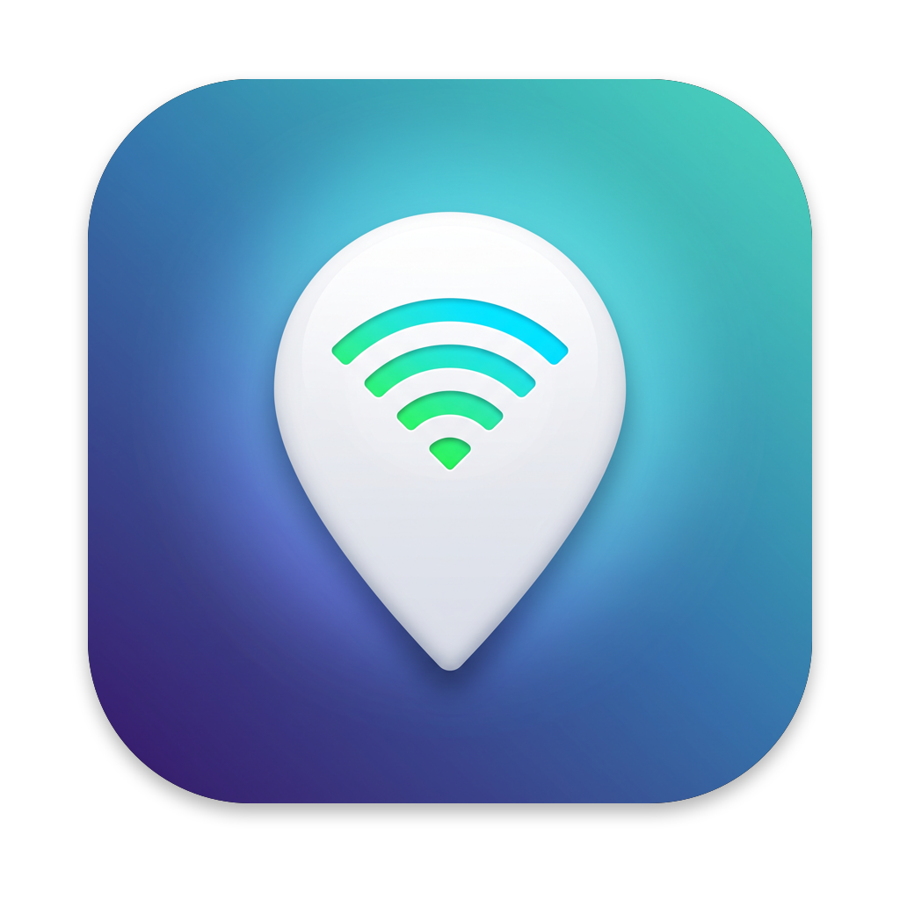
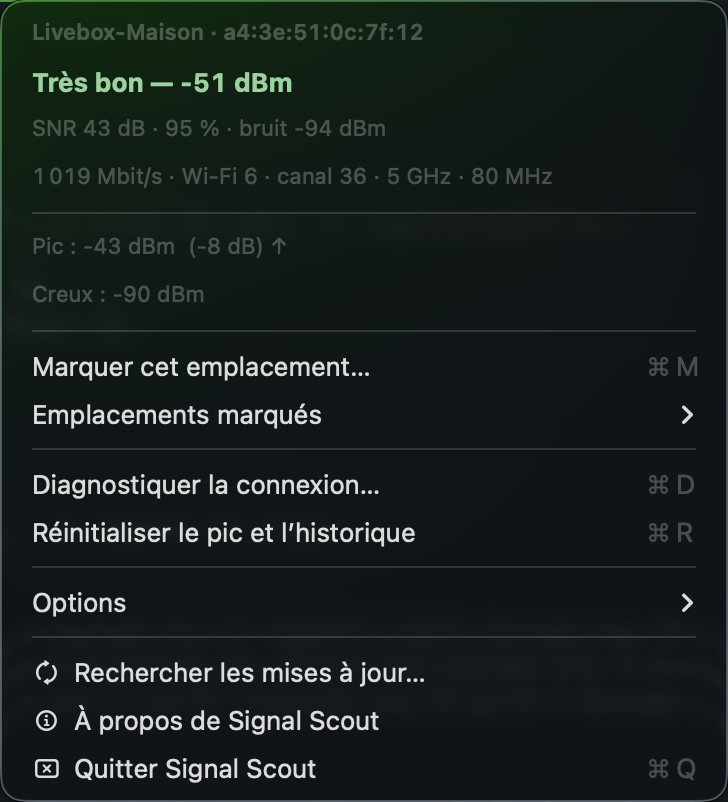
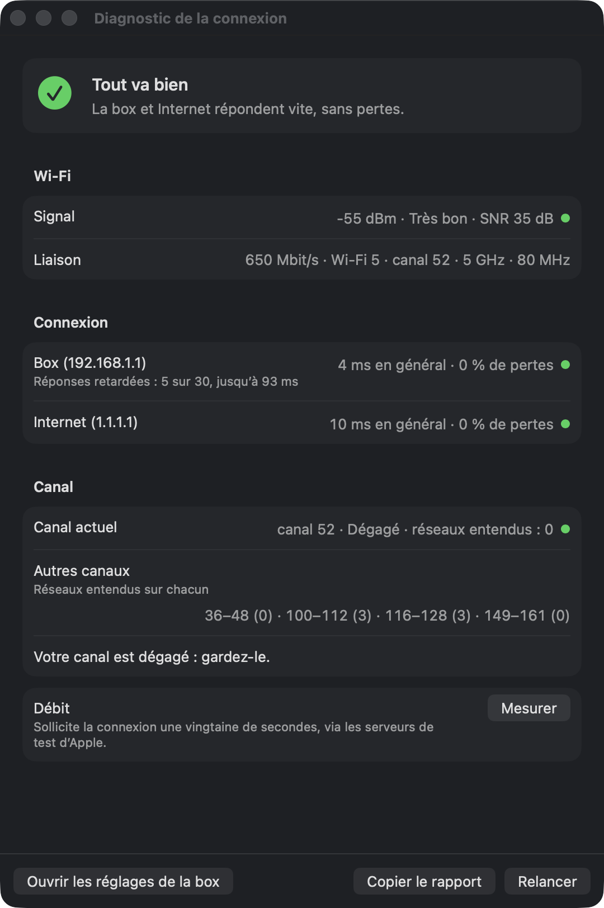

<p align="center">
  
</p>

<h1 align="center">Signal Scout</h1>

<p align="center">
  <strong>La force de votre Wi-Fi, en direct dans la barre des menus du Mac.</strong><br>
  Trouvez le meilleur endroit pour travailler ou pour placer votre box, et sachez en un clic si un
  problème vient de votre Wi-Fi ou de votre connexion Internet.
</p>

<p align="center">
  <a href="https://github.com/Asteerix/signal-scout-releases/releases/latest"><strong>Télécharger la dernière version</strong></a>
  · macOS 14 ou plus récent · Apple silicon et Intel · gratuit
</p>

<p align="center">
  
</p>

## Ce que fait Signal Scout

- **Le signal en direct** dans la barre des menus : une mini-courbe, la mesure et un verdict en
  couleur, de *Excellent* à *Mort*. Promenez-vous menu ouvert et regardez-le monter ou baisser.
- **Les emplacements marqués** : notez le signal au bureau, au salon, dans la chambre, puis
  comparez-les, classés du meilleur au pire. Chaque emplacement retient aussi le réseau et la borne
  captés, pour distinguer la box d'un répéteur.
- **Le diagnostic de la connexion** (⌘D) : quelques secondes de mesures pour savoir si le problème
  vient du Wi-Fi, de la box ou d'Internet, avec un conseil concret, par exemple « Réglez votre box
  sur le canal 44 » quand les réseaux voisins encombrent le vôtre.
- **Un test de débit** en option, avec les serveurs d'Apple, et un **rapport** à copier pour la
  personne qui vous aide.

<p align="center">
  
</p>

## Installation

1. **Téléchargez** le fichier `Signal-Scout-<version>.dmg` en bas de la
   [dernière version](https://github.com/Asteerix/signal-scout-releases/releases/latest), dans
   la partie **Assets**.
2. **Ouvrez** le fichier téléchargé. Une fenêtre montre l'app et un raccourci vers le dossier
   Applications.
3. **Glissez** l'icône **Signal Scout** sur **Applications**.
4. **Ouvrez** le dossier Applications, puis double-cliquez sur **Signal Scout**.

### La première ouverture : autoriser l'app

Signal Scout n'est pas distribuée par l'App Store. Si macOS refuse de l'ouvrir la première fois,
avec un message du type « Signal Scout n'a pas été ouvert » ou « Apple n'a pas pu confirmer que
Signal Scout ne contient pas de logiciel malveillant », c'est normal, et cela ne se produit
qu'une fois :

1. Dans ce message, cliquez sur **Terminé** (ou **OK**). Surtout pas sur *Placer dans la
   corbeille*.
2. Ouvrez le menu **Pomme** () › **Réglages Système** › **Confidentialité et sécurité**.
3. Faites défiler jusqu'à la section **Sécurité**. En face du message sur Signal Scout, cliquez sur
   **Ouvrir quand même**.
4. Confirmez dans la fenêtre qui s'affiche (**Ouvrir quand même** ou **Ouvrir**), puis avec votre
   mot de passe ou Touch ID.

Le bouton **Ouvrir quand même** reste disponible environ une heure après la tentative
d'ouverture ; passé ce délai, double-cliquez de nouveau sur l'app pour le faire réapparaître.
Apple décrit la procédure dans
[Ouvrir une app Mac d'un développeur non identifié](https://support.apple.com/fr-fr/guide/mac-help/mh40616/mac).

<details>
<summary>Vérifier le fichier téléchargé (facultatif)</summary>

Chaque version publie la somme SHA-256 de son image disque (`.dmg.sha256`). Dans le Terminal,
depuis le dossier Téléchargements :

```sh
shasum -a 256 -c Signal-Scout-<version>.dmg.sha256
```

La commande répond `OK` si le fichier est intact.

</details>

### Ensuite

Signal Scout n'a **ni fenêtre ni icône dans le Dock** : elle vit dans la **barre des menus**, en
haut à droite de l'écran, à côté de l'horloge. Au premier lancement, une fenêtre de bienvenue
indique où la trouver et propose trois réglages : le lancement à l'ouverture de session,
l'affichage du nom du réseau, et la recherche quotidienne des mises à jour.

## Mettre à jour

Si vous avez coché la recherche des mises à jour, Signal Scout signale une nouvelle version dans
son menu. Sinon, choisissez **Rechercher les mises à jour…**. Pour installer la nouvelle version :
quittez Signal Scout, téléchargez le nouveau `.dmg`, glissez l'app sur **Applications** et
choisissez **Remplacer**. Vos options et vos emplacements marqués sont conservés.

## Confidentialité

Signal Scout ne contient ni compte, ni publicité, ni outil de statistiques. Elle ne contacte
Internet que dans trois cas, tous à votre initiative :

- **Le diagnostic** envoie des pings à votre box et à un serveur public (1.1.1.1, ou 8.8.8.8 s'il
  ne répond pas), et écoute les réseaux Wi-Fi voisins.
- **Le test de débit**, seulement quand vous cliquez sur **Mesurer**, utilise les serveurs de test
  d'Apple (l'outil `networkQuality` de macOS).
- **La recherche des mises à jour**, une fois par jour si vous l'avez activée, demande à GitHub le
  numéro de la dernière version.

La localisation sert uniquement à lire le nom des réseaux Wi-Fi, comme macOS l'exige : l'app ne
demande jamais la position du Mac. Options et emplacements restent sur le Mac, dans
`~/Library/Preferences/com.amaury.wifirssi.plist`.

## Désinstaller

1. Décochez **Options › Lancer à l'ouverture de session**.
2. Choisissez **Quitter Signal Scout** dans son menu.
3. Placez **Signal Scout** du dossier Applications dans la corbeille.
4. Facultatif, pour effacer aussi options et emplacements, tapez dans le Terminal :
   `defaults delete com.amaury.wifirssi`.

## Aide

Une question, un problème, une idée ? Ouvrez un
[ticket](https://github.com/Asteerix/signal-scout-releases/issues) en décrivant votre Mac et ce
que vous observez. Pour un souci de connexion, joignez le rapport du diagnostic : bouton
**Copier le rapport**, puis collez-le dans le ticket.

Ce dépôt ne contient que les versions à télécharger ; le code source est privé.
